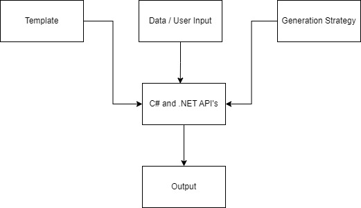

# Design-Time Code Generation
Introductory Design-Time Code Generation project using C#. 

## Give a Star! :star:

If you like or are using this project to learn or start your solution, please give it a star. Thanks!

## Table of Contents
- [What is Design-Time Code Generation](#whatisit)

  

## What is Design-Time Code Generation

 


 ### Template

 ```csharp
    var result = $$"""
        public record struct {{model.Name}}({{string.Join(",",model.Properties.Select(x => $"{x.Type} {x.Name}"))}});
        """;
 ```

 ### Data / Model / User Input
 ```data
{
    "simpleTypes": [
      {
        "name": "HelloWorld",
        "namespace": "Target",
        "properties": [
          {
            "name": "Greeting",
            "type": "string"
          }
        ]
      }
    ]
}
 ```

 ### Generation Strategy
 ```csharp
void Generate(SimpleType model)
{

    string validations = string.Join(Environment.NewLine, model.Validations.Select(x =>
    {
        return $$"""
        if ({{model.Name.ToCamelCase()}} > {{x.MaxValue}})
        {
            throw new ArgumentOutOfRangeException(nameof({{model.Name.ToCamelCase()}}), "{{x.ErrorMessasge}}");
        }

        """;
    }));

    var result = $$"""
        public readonly struct {{model.Name.ToPascalCase()}}
        {
            private readonly {{model.SourceType}} {{model.Name.ToCamelCase()}};

            public {{model.Name.ToPascalCase()}}({{model.SourceType}} {{model.Name.ToCamelCase()}})
            {
        {{validations.Indent(2)}}
                this.{{model.Name.ToCamelCase()}} = {{model.Name.ToCamelCase()}};
            }

            public static implicit operator {{model.SourceType}}({{model.Name.ToPascalCase()}} value) => value.{{model.Name.ToCamelCase()}};
            public static explicit operator {{model.Name.ToPascalCase()}}({{model.SourceType}} value) => new {{model.Name.ToPascalCase()}}(value);

            public override string ToString() => $"{{{model.Name.ToCamelCase()}}}";
        }
        """;

    File.WriteAllText($@"..\..\..\..\Target\{model.Name}.g.cs", result);
}
 ```

### Additional Resources
